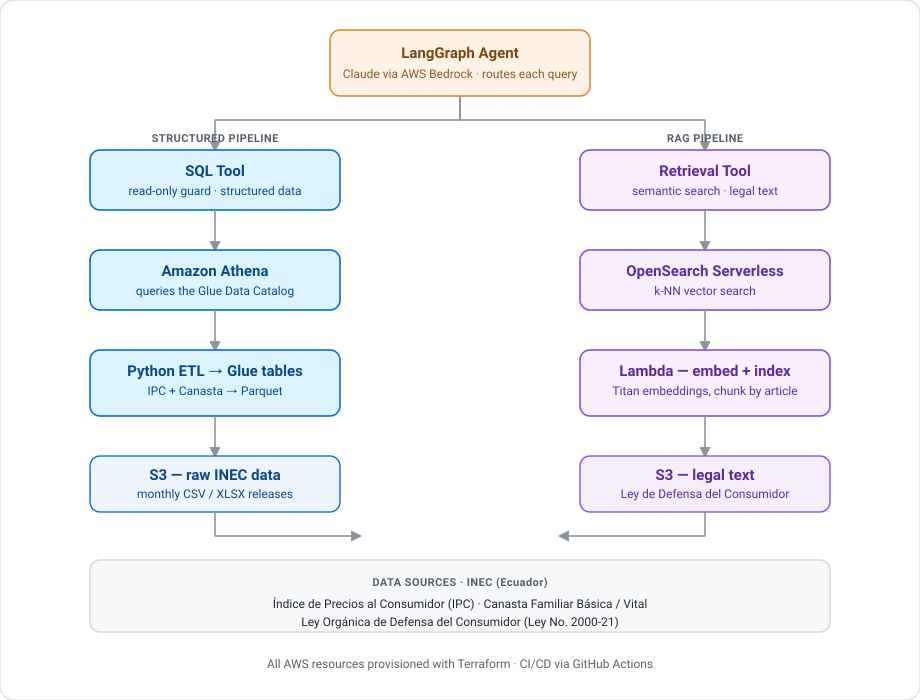

# Consumer Price Guardian

[](https://github.com/karisaylema/consumer-price-guardian/actions/workflows/ci.yml)
[](LICENSE)

A multi-tool LLM agent that helps consumers and analysts understand price trends in Ecuador and know their rights when prices move — by combining official INEC price statistics with the text of Ecuador's consumer protection law.

Built with LangGraph, AWS Bedrock, and a dual-pipeline data architecture on AWS.

## The problem

Understanding whether a price increase is "normal" or something a consumer can act on requires two very different kinds of information:

- **Structured data**: the Consumer Price Index (IPC) and Canasta Familiar Básica (basic household basket cost), published monthly by Ecuador's national statistics institute (INEC), broken down by city and product category
- **Unstructured data**: the Ley Orgánica de Defensa del Consumidor (Consumer Protection Law), which defines what protections apply when pricing, billing, or product quality is in dispute

Answering a question like *"The cost of the basic basket in Guayaquil went up this month — what protection do I have if a supplier raises prices without justification?"* requires querying the actual price trend AND retrieving the specific article of the law that applies. This agent does both, then reasons over the combination.

## Architecture

Two independent pipelines feed a LangGraph agent that decides which tool(s) to call per query.

<p align="center">
  
</p>

**Why two pipelines instead of one?** The structured pipeline (Glue + Athena) is optimized for trend analysis over monthly time-series data by city and product category — the kind of query SQL is built for. The RAG pipeline (Lambda + OpenSearch) is optimized for semantic similarity over legal prose, where the answer isn't a row but a specific article. Forcing both through the same engine would mean compromising one or the other.

## Stack

| Layer | Technology |
|---|---|
| Agent orchestration | LangGraph |
| LLM | Claude via AWS Bedrock |
| Structured ETL | Python (Pandas + PyArrow) → Parquet |
| Data catalog | AWS Glue Data Catalog |
| Structured query engine | Amazon Athena |
| Vector store | OpenSearch Serverless |
| RAG indexing | AWS Lambda |
| Infrastructure as Code | Terraform |
| CI/CD | GitHub Actions |
| Data sources | INEC (Índice de Precios al Consumidor, Canasta Familiar Básica), Ley Orgánica de Defensa del Consumidor (Ley No. 2000-21) |

## Repo structure

```
.
├── src/
│   ├── ingestion/    # Python ETL for INEC IPC and Canasta Familiar data
│   ├── rag/          # Lambda functions: embedding + indexing + retrieval
│   ├── agent/         # LangGraph agent definition and tool wiring
│   └── shared/        # Shared utilities (config, AWS clients, schemas)
├── infra/             # Terraform modules for all AWS resources
├── tests/
│   ├── unit/
│   └── integration/
├── docs/               # Architecture decisions, data source notes
└── .github/workflows/  # CI/CD pipelines
```

## Status

🚧 Work in progress. See [docs/roadmap.md](docs/roadmap.md) for what's built vs planned.

## Running locally

See [docs/setup.md](docs/setup.md) for local development setup and how to point the agent at a sandbox AWS environment.

## Example queries this agent should eventually answer

- "How much has the Canasta Familiar Básica changed in Quito over the past 12 months?"
- "If my utility bill looks unusually high compared to my past consumption, what does Ecuadorian law say?"
- "What recourse does a consumer have under Ley 2000-21 if a product fails a quality control check?"

## Why this project

I built this to apply patterns I use in production backend/data engineering roles — event-driven ETL, IaC, and LLM tool orchestration — to a domain (consumer price transparency) with genuinely public, current, well-structured data from Ecuador's national statistics institute, paired with the actual law that governs consumer rights. It's also a testbed for AWS Bedrock integration patterns beyond simple prompt/response.
